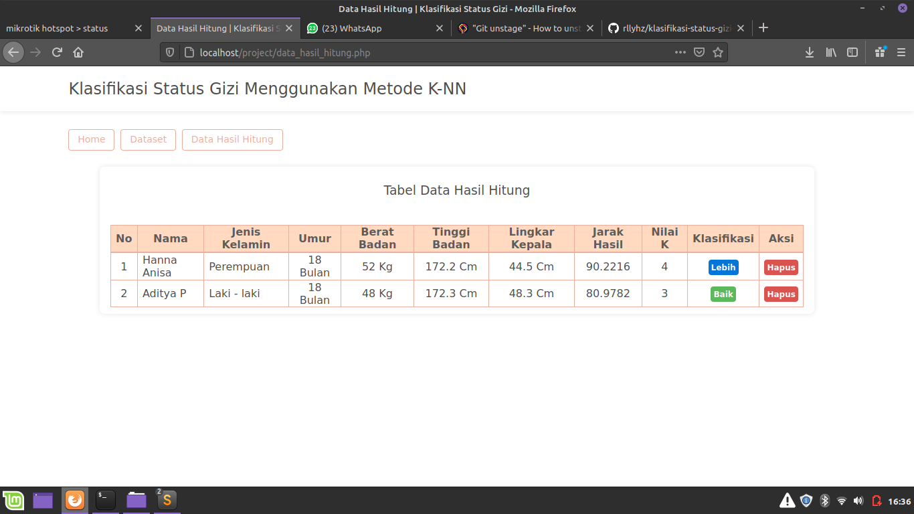

# Klasifikasi Status Gizi Menggunakan Metode K-NN

Website klasifikasi status gizi pada bayi menggunakan metode k nearest neighbors.

## Deskripsi Project

Project ini dibuat untuk memenuhi tugas skripsi.

## Preview Tampilan

Halaman Home

Halaman Hasil Perhitungan Menggunakan metode K-NN

Halaman Data Hasil Perhitungan Menggunakan metode K-NN

Halaman Dataset

Halaman Edit Dataset

Form Tambah Dataset

Halaman Import Dataset

